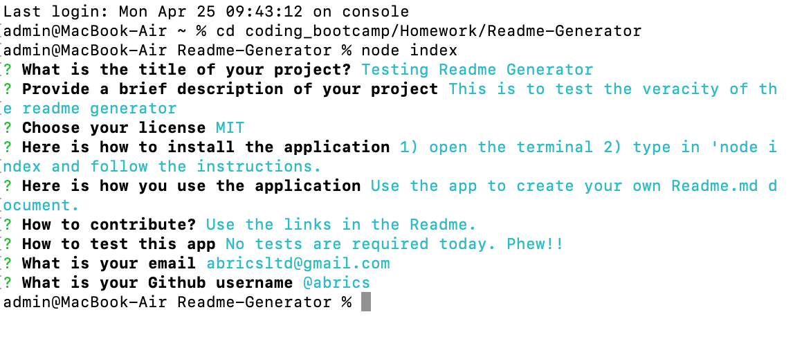

# Node ReadMe file Generator


## Description

The ReadMe Generator automates the process of producing a Readme.md file for each project. 
The app is simple to uses a question and snswer format to populate a form.
<br>
### Table of Contents
[Description](https://github.com/AbriCS/Readme-Generator#description)<br>
[Getting Started](https://github.com/AbriCS/Readme-Generator#getting-started)<br>
[Executing Program](https://github.com/AbriCS/Readme-Generator#executing-program)<br>
[Walkthrough Video](https://github.com/AbriCS/Readme-Generator#walkthrough-video)<br>
[Screenshot](https://github.com/AbriCS/Readme-Generator#screenshot)<br>
[Further Information](https://github.com/AbriCS/Readme-Generator#further-information)<br>


## Getting Started

The following are the minimum requirements;

- open a terminal
- download npm
- install node 

```
 Node must be installed to run this program.
 ```


### Executing program

- Open the terminal 
- Navigate to the app in the folder structure
- In the command line type 'node index' without the quotation marks
- Answer the questions as they appear
- On completion of the final question, the terminal will return to the folder structure and an Output Readme will   
  have been produced.
- To preview your document in VSCode, right click the Readme.md tab and select Preview from the dropdown list.


### Walkthrough Video


### Screenshot of deployed app




## Further Information and Help

For instructions on how to use the application, please refer to the walkthrough video.  Should you have further questions about the app then please do not hesitate to contact the Author.

```
Project collaborators are always welcome

```

## Author

- Jean McLeod
- <a href="mailto:AbriCSltd@gmail.com">email me</a>
- Github [@AbriCSltd](https://github.com/AbriCS/Readme-Generator)

## Version History

- <b>0.2  The Latest<b>
    - Click [here](https://abrics.github.io/) for the final release. 2022/03/04.

- 0.1
  - Initial Release 2022/03/02

## License

This project is licensed under the [Creative Commons](https://creativecommons.org/licenses/by/2.0/uk/) Licence and is free to use and develop. Citation of the Author is recommended.

## Acknowledgments

Inspiration, code snippets, etc.

- [awesome-readme](https://github.com/matiassingers/awesome-readme)